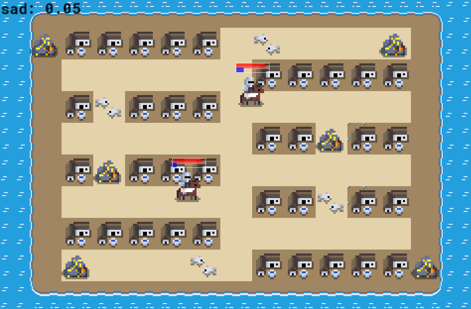

# Emergent AI

__*Toolset for producing emergent gameplay for games written in Rust*__

## About
Emergent AI library is a set of modular building blocks to use for building smart
agents, events and anything you want. The goal of this library is to generalize
most well-known modern AI techniques into smaller units that when put together
can produce smart behaviors of agents and game world itself.

When we focused on turning parts of modern AI systems into building blocks, we
end up with these decision makers:
- __Machinery__ - Finite State Machine (or simply network of states connected by
  conditions to met for jumps to happen).
- __Reasoner__ - Utility AI agent (that scores each state and selects one with
  the highest score).
- __Planner__ - Goal Oriented Action Planning agent (finds the best path through
  all possible actions for goal selected by another decision maker assigned into
  this planner).
- __Sequencer__ - Goes through states (ones that are possible to run) in a sequence.
- __Selector__ - Selects only one state from list of possible states to run.
- __Parallelizer__ - Runs all states (that are possible to run) at the same time.

This modularity gives more power to the user, it allows user to build hierarchies
of different decision makers to build the exact behavior user wants without
putting limits on what is achievable!

Read more about all the concepts in the documentation
---
[https://docs.rs/emergent](https://docs.rs/emergent)

Read about developing your own AI systems in the book
---
[https://psichix.github.io/emergent/][https://psichix.github.io/emergent/]

## Media

#### Utility AI:

## Roadmap
- [ ] Create a small demo project to showcase the usage of this library.
- [ ] Write a book describing how AI works in details and how to develop AI for games.
- [ ] Research adding support for evolution-based neural networks?
