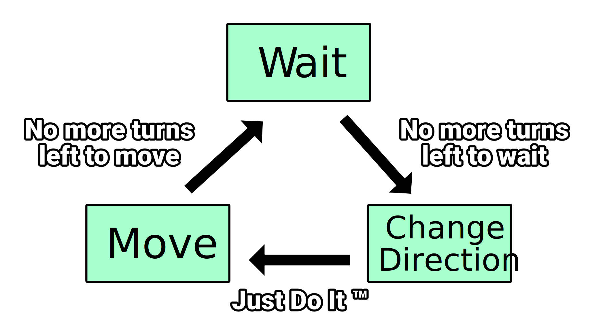

# Finite State Machine

When starting the journey with AI systems, Finite State Machines (FSM in short
from now on) are always the first choice for AI system for a reason - they are
the simplest to implement and the most intuitive decision making engines ever
invented.

Here, take a look at the states and transitions of our simple enemy behavior:



Each block is a state that enemy can be in and every arrow is a transition with
condition that has to be met to allow for transition to happen.
Here in our case there are simple, single transitions pointing from one state to
another, but in more complex behaviors there can be _infinite_ number of
transitions.

Decision making for FSM has a really simple rule applied to it:

> When decision about state change has to be made, FSM goes through all transitions
> that starts from active state and validates their conditions, first one that
> succeeds triggers change from active state to one that transition points to.

Table of contents:
---

- [How it works](#how-it-works)
- [How to implement FSM](#how-to-implement-fsm)
  - [The dummy way](#the-dummy-way)
  - [The better way](#the-better-way)
- [Use of Machinery decision maker from emergent crate](#use-of-machinery-decision-maker-from-emergent-crate)
- [Typical use cases for FSM](#typical-use-cases-for-fsm)

How it works
---

Imagine we start from __Change Direction__ state and we tell FSM to make a
decision, it looks at transitions pointing from this state, here there is only
one: __Move__ wit condition: __Just Do It__ (which here it means: it always
succeeds). Since this tansition condition succeeded, FMS changes its active state
to __Move__ state and enemy moves forward for few turns in the direction previously
set by __Change Direction__ state.

In the mean time we run decision making from time to time (can be each frame,
can be each second - usually decision making runs at slower fewquency than game
frames, or sometimes it is triggered only when decision making engine receives
an event that tells that important change in game state happened and FSM should
make a decision about its new state).

At some point when FSM runs its decision making, goes through __Move__ state
transitions and finds out that condition of a transition pointing to __Wait__
state reports no more move turns, so FSM changes its active state to __Wait__
which will wait few turns doing nothing.

When there is no more waiting turns left, FSM switches back to __Change Direction__
state, which all of it makes "Change Direction, Move, Wait" behavior of our Enemy.
Really simple, right?

How to implement FSM
---

In chapter [First steps] we have shown the easiest FSM implementation using enums
but the downside of that approach is that when number of states gets bigger, and
number of possible state changes grow with them, we will eventually end up with
spaghetti of state changes put all over the place with no clear way to see all
the states and their transitions in one place. That slows down understanding of
states and relations between them, but we can simplify that even further by
making an easy, modular FSM engine.

I'll show you two ways that FSM are implemented: dummy way and better way.

### The dummy way

Dummy way of implementing FSM works like this: There is a `State` trait that will
be implemented for all states. This state has `update` method with context to
read from / write to and it returns optional state ID. We do this bc we want
states to do their work and that state might tells FSM to change into new state
after FSM updates this state.

```rust
# use std::{collections::HashMap, hash::Hash};
#
trait State<K, T> {
  // FSM runs this method only on curently active state, and after the update it
  // tries to change active state to whatever state ID we return here (None means
  // no change expected).
  fn update(&mut self, context: &mut T) -> Option<K>;
}

struct FSM<K, T> {
  states: HashMap<K, Box<dyn State<K, T>>>,
  active_state: K,
}

impl<K: Hash + Eq, T> FSM<K, T> {
  fn new(active_state: K) -> Self {
    Self {
      states: Default::default(),
      active_state,
    }
  }

  fn state<S: State<K, T> + 'static>(mut self, id: K, state: S) -> Self {
    self.states.insert(id, Box::new(state));
    self
  }

  fn set_active_state(&mut self, id: K) {
    if self.states.contains_key(&id) {
      self.active_state = id;
    }
  }

  fn update(&mut self, context: &mut T) {
    if let Some(state) = self.states.get_mut(&self.active_state) {
      if let Some(id) = state.update(context) {
        self.set_active_state(id);
      }
    }
  }
}
```

This might looks like the solution used in [First steps] but with extra steps in
form of states as trait objects. Yes, you're right, so what's the goal of that?
The goal is that with this approach we are able to "easly" iterate on states,
quickly add new ones or remove ones we do not need anymore and all that FSM setup
stay in one place and we have _almost completely_ decoupled states one from
another. Why did i said "almost completely decoupled"? Well, we still have
hardcoded states IDs of transitions in state logic, that's not ok, we will fix
that when we will do _the better way_ of implementing FSM later, for now let's
see how do we use FSM system we have created.

Let's start with implementing enemy states:

```rust
# trait State<K, T> {
#   fn update(&mut self, context: &mut T) -> Option<K>;
# }
#
# enum Direction {
#   Up,
#   Down,
#   Left,
#   Right,
# }
#
# impl Direction {
#   fn horizontal(&self) -> isize {
#     match self {
#       Self::Left => -1,
#       Self::Right => 1,
#       _ => 0,
#     }
#   }
#
#   fn vertical(&self) -> isize {
#     match self {
#       Self::Up => -1,
#       Self::Down => 1,
#       _ => 0,
#     }
#   }
#
#   fn next(&self) -> Self {
#     match self {
#       Self::Up => Self::Right,
#       Self::Down => Self::Left,
#       Self::Left => Self::Up,
#       Self::Right => Self::Down,
#     }
#   }
# }
#
// This enum will be used as key for states.
#[derive(Hash, PartialEq, Eq)]
enum EnemyState {
  Wait,
  Move,
  ChangeDirection,
}

// And this struct will hold all enemy data used by the states.
// It will be passed to FSM as context.
struct EnemyData {
  position: (isize, isize),
  direction: Direction,
}

// It holds number of waiting turns.
struct EnemyWaitState(pub usize);

impl State<EnemyState, EnemyData> for EnemyWaitState {
  fn update(&mut self, context: &mut EnemyData) -> Option<EnemyState> {
    if self.0 > 0 {
      self.0 -= 1;
      None
    } else {
      Some(EnemyState::ChangeDirection)
    }
  }
}

// It holds number of moving turns.
struct EnemyMoveState(pub usize);

impl State<EnemyState, EnemyData> for EnemyMoveState {
  fn update(&mut self, context: &mut EnemyData) -> Option<EnemyState> {
    if self.0 > 0 {
      self.0 -= 1;
      context.position.0 += context.direction.horizontal();
      context.position.1 += context.direction.vertical();
      None
    } else {
      Some(EnemyState::Wait)
    }
  }
}

struct EnemyChangeDirectionState;

impl State<EnemyState, EnemyData> for EnemyChangeDirectionState {
  fn update(&mut self, context: &mut EnemyData) -> Option<EnemyState> {
    context.direction = context.direction.next();
    Some(EnemyState::Move)
  }
}
```

Although code size has grown comparing to implementation used in [First steps],
we have modularized states. That would get useful when for example we would have
many different NPC types using same context type to store their data and by that
we would share same states across multiple AI agent types - we would reduce
duplication of the logic and would allow for quick adding/removing possible
states for certain types of NPCs, sadly we don't show that here.

Now let's take a look at our enemy type setup:

```rust
# use std::{collections::HashMap, hash::Hash};
#
# trait State<K, T> {
#   fn update(&mut self, context: &mut T) -> Option<K>;
# }
#
# struct FSM<K, T> {
#   states: HashMap<K, Box<dyn State<K, T>>>,
#   active_state: K,
# }
#
# impl<K: Hash + Eq, T> FSM<K, T> {
#   fn new(active_state: K) -> Self {
#     Self {
#       states: Default::default(),
#       active_state,
#     }
#   }
#
#   fn state<S: State<K, T> + 'static>(mut self, id: K, state: S) -> Self {
#     self.states.insert(id, Box::new(state));
#     self
#   }
#
#   fn set_active_state(&mut self, id: K) {
#     if self.states.contains_key(&id) {
#       self.active_state = id;
#     }
#   }
#
#   fn update(&mut self, context: &mut T) {
#     if let Some(state) = self.states.get_mut(&self.active_state) {
#       if let Some(id) = state.update(context) {
#         self.set_active_state(id);
#       }
#     }
#   }
# }
#
# #[derive(Debug, PartialEq, Eq)]
# enum Direction {
#   Up,
#   Down,
#   Left,
#   Right,
# }
#
# impl Direction {
#   fn horizontal(&self) -> isize {
#     match self {
#       Self::Left => -1,
#       Self::Right => 1,
#       _ => 0,
#     }
#   }
#
#   fn vertical(&self) -> isize {
#     match self {
#       Self::Up => -1,
#       Self::Down => 1,
#       _ => 0,
#     }
#   }
#
#   fn next(&self) -> Self {
#     match self {
#       Self::Up => Self::Right,
#       Self::Down => Self::Left,
#       Self::Left => Self::Up,
#       Self::Right => Self::Down,
#     }
#   }
# }
#
# #[derive(Debug, Hash, PartialEq, Eq)]
# enum EnemyState {
#   Wait,
#   Move,
#   ChangeDirection,
# }
#
# struct EnemyData {
#   position: (isize, isize),
#   direction: Direction,
# }
#
# struct EnemyWaitState(pub usize);
#
# impl State<EnemyState, EnemyData> for EnemyWaitState {
#   fn update(&mut self, context: &mut EnemyData) -> Option<EnemyState> {
#     if self.0 > 0 {
#       self.0 -= 1;
#       None
#     } else {
#       Some(EnemyState::ChangeDirection)
#     }
#   }
# }
#
# struct EnemyMoveState(pub usize);
#
# impl State<EnemyState, EnemyData> for EnemyMoveState {
#   fn update(&mut self, context: &mut EnemyData) -> Option<EnemyState> {
#     if self.0 > 0 {
#       self.0 -= 1;
#       context.position.0 += context.direction.horizontal();
#       context.position.1 += context.direction.vertical();
#       None
#     } else {
#       Some(EnemyState::Wait)
#     }
#   }
# }
#
# struct EnemyChangeDirectionState;
#
# impl State<EnemyState, EnemyData> for EnemyChangeDirectionState {
#   fn update(&mut self, context: &mut EnemyData) -> Option<EnemyState> {
#     context.direction = context.direction.next();
#     Some(EnemyState::Move)
#   }
# }
#
// We are using composition of FSM and enemy data to please the borrow checker
// and allow FSM to mutate enemy data on update.
struct Enemy {
  data: EnemyData,
  fsm: FSM<EnemyState, EnemyData>,
}

impl Enemy {
  fn new(x: isize, y: isize, direction: Direction) -> Self {
    let mut data = EnemyData {
      position: (x, y),
      direction,
    };
    let mut fsm = FSM::new(EnemyState::ChangeDirection)
      .state(EnemyState::Wait, EnemyWaitState(1))
      .state(EnemyState::ChangeDirection, EnemyChangeDirectionState)
      .state(EnemyState::Move, EnemyMoveState(2));

    Self { data, fsm }
  }

  fn update(&mut self) {
    self.fsm.update(&mut self.data);
  }
}
```

You can see now that because we have modularized states, whenever we would want
to create new state we create a state object then apply it to whatever FSM engine
we want without digging through all the code to adapt AI agent to use of new
state - we have simplified behavior development and reduced the time needed for
implementing changes to the AI. Modularity is the key to easier development when
complexity of the AI scales up.

And here are tests that show how enemy state changes in time (look how state
changes after every `update` method call):

```rust
# use std::{collections::HashMap, hash::Hash};
#
# trait State<K, T> {
#   fn update(&mut self, context: &mut T) -> Option<K>;
# }
#
# struct FSM<K, T> {
#   states: HashMap<K, Box<dyn State<K, T>>>,
#   active_state: K,
# }
#
# impl<K: Hash + Eq, T> FSM<K, T> {
#   fn new(active_state: K) -> Self {
#     Self {
#       states: Default::default(),
#       active_state,
#     }
#   }
#
#   fn state<S: State<K, T> + 'static>(mut self, id: K, state: S) -> Self {
#     self.states.insert(id, Box::new(state));
#     self
#   }
#
#   fn set_active_state(&mut self, id: K) {
#     if self.states.contains_key(&id) {
#       self.active_state = id;
#     }
#   }
#
#   fn update(&mut self, context: &mut T) {
#     if let Some(state) = self.states.get_mut(&self.active_state) {
#       if let Some(id) = state.update(context) {
#         self.set_active_state(id);
#       }
#     }
#   }
# }
#
# #[derive(Debug, PartialEq, Eq)]
# enum Direction {
#   Up,
#   Down,
#   Left,
#   Right,
# }
#
# impl Direction {
#   fn horizontal(&self) -> isize {
#     match self {
#       Self::Left => -1,
#       Self::Right => 1,
#       _ => 0,
#     }
#   }
#
#   fn vertical(&self) -> isize {
#     match self {
#       Self::Up => -1,
#       Self::Down => 1,
#       _ => 0,
#     }
#   }
#
#   fn next(&self) -> Self {
#     match self {
#       Self::Up => Self::Right,
#       Self::Down => Self::Left,
#       Self::Left => Self::Up,
#       Self::Right => Self::Down,
#     }
#   }
# }
#
# #[derive(Debug, Hash, PartialEq, Eq)]
# enum EnemyState {
#   Wait,
#   Move,
#   ChangeDirection,
# }
#
# struct EnemyData {
#   position: (isize, isize),
#   direction: Direction,
# }
#
# struct EnemyWaitState(pub usize);
#
# impl State<EnemyState, EnemyData> for EnemyWaitState {
#   fn update(&mut self, context: &mut EnemyData) -> Option<EnemyState> {
#     if self.0 > 0 {
#       self.0 -= 1;
#       None
#     } else {
#       Some(EnemyState::ChangeDirection)
#     }
#   }
# }
#
# struct EnemyMoveState(pub usize);
#
# impl State<EnemyState, EnemyData> for EnemyMoveState {
#   fn update(&mut self, context: &mut EnemyData) -> Option<EnemyState> {
#     if self.0 > 0 {
#       self.0 -= 1;
#       context.position.0 += context.direction.horizontal();
#       context.position.1 += context.direction.vertical();
#       None
#     } else {
#       Some(EnemyState::Wait)
#     }
#   }
# }
#
# struct EnemyChangeDirectionState;
#
# impl State<EnemyState, EnemyData> for EnemyChangeDirectionState {
#   fn update(&mut self, context: &mut EnemyData) -> Option<EnemyState> {
#     context.direction = context.direction.next();
#     Some(EnemyState::Move)
#   }
# }
#
# struct Enemy {
#   data: EnemyData,
#   fsm: FSM<EnemyState, EnemyData>,
# }
#
# impl Enemy {
#   fn new(x: isize, y: isize, direction: Direction) -> Self {
#     let mut data = EnemyData {
#       position: (x, y),
#       direction,
#     };
#     let mut fsm = FSM::new(EnemyState::ChangeDirection)
#       .state(EnemyState::Wait, EnemyWaitState(1))
#       .state(EnemyState::ChangeDirection, EnemyChangeDirectionState)
#       .state(EnemyState::Move, EnemyMoveState(2));
#
#     Self { data, fsm }
#   }
#
#   fn update(&mut self) {
#     self.fsm.update(&mut self.data);
#   }
# }
#
let mut enemy = Enemy::new(0, 0, Direction::Up);
assert_eq!(enemy.fsm.active_state, EnemyState::ChangeDirection);
assert_eq!(enemy.data.position.0, 0);
assert_eq!(enemy.data.position.1, 0);
assert_eq!(enemy.data.direction, Direction::Up);

for i in 0..3 {
  enemy.update();
  assert_eq!(enemy.fsm.active_state, EnemyState::Move);
  assert_eq!(enemy.data.position.0, i);
  assert_eq!(enemy.data.position.1, 0);
  assert_eq!(enemy.data.direction, Direction::Right);
}
for _ in 0..2 {
  enemy.update();
  assert_eq!(enemy.fsm.active_state, EnemyState::Wait);
  assert_eq!(enemy.data.position.0, 2);
  assert_eq!(enemy.data.position.1, 0);
  assert_eq!(enemy.data.direction, Direction::Right);
}
enemy.update();
assert_eq!(enemy.fsm.active_state, EnemyState::ChangeDirection);
assert_eq!(enemy.data.position.0, 2);
assert_eq!(enemy.data.position.1, 0);
assert_eq!(enemy.data.direction, Direction::Right);
```

Now, do you remember we have been talking about "almost completely decoupled
states"? While the downside of this approach to decision making by returning the
ID of state to change into, we can avoid that and actually completely decouple
states from one another if we implement FSM the better way.

### The better way

Our goal is to decouple states from one another completely, to do that we have
to find out how states are coupled right now - let's take a look at some state
logic:

```rust
# trait State<K, T> {
#   fn update(&mut self, context: &mut T) -> Option<K>;
# }
#
# #[derive(Debug, PartialEq, Eq)]
# enum Direction {
#   Up,
#   Down,
#   Left,
#   Right,
# }
#
# impl Direction {
#   fn horizontal(&self) -> isize {
#     match self {
#       Self::Left => -1,
#       Self::Right => 1,
#       _ => 0,
#     }
#   }
#
#   fn vertical(&self) -> isize {
#     match self {
#       Self::Up => -1,
#       Self::Down => 1,
#       _ => 0,
#     }
#   }
#
#   fn next(&self) -> Self {
#     match self {
#       Self::Up => Self::Right,
#       Self::Down => Self::Left,
#       Self::Left => Self::Up,
#       Self::Right => Self::Down,
#     }
#   }
# }
#
# #[derive(Debug, Hash, PartialEq, Eq)]
# enum EnemyState {
#   Wait,
#   Move,
#   ChangeDirection,
# }
#
# struct EnemyData {
#   position: (isize, isize),
#   direction: Direction,
# }
#
struct EnemyMoveState(pub usize);

impl State<EnemyState, EnemyData> for EnemyMoveState {
  fn update(&mut self, context: &mut EnemyData) -> Option<EnemyState> {
    if self.0 > 0 {
      self.0 -= 1;
      context.position.0 += context.direction.horizontal();
      context.position.1 += context.direction.vertical();
      None
    } else {
      Some(EnemyState::Wait)
    }
  }
}
```

You can see that state update method contains conditions that tell if we should
change into new state and state logic itself (enemy movement).

What we can do with it is we can abstract conditions and state changes into
separate code units and let states only perform their actual logic on update,
also we add a state method to be called when state gets activated so it can setup
context for that state updates:

```rust
type Condition<T> = fn(&T) -> bool;

trait State<T> {
  fn activated(&mut self, context: &mut T) {}
  fn update(&mut self, context: &mut T) {}
}
```

Since we did that we also have to introduce new FSM transition and state types.
FSM state will now hold the actual state object and list of all possible
transitions, it will also be able to decide if FSM should change into new state
by testing each transition condition and first one that passes, its state ID gets
returned and FSM will then activate that state:

```rust
# type Condition<T> = fn(&T) -> bool;
#
# trait State<T> {
#   fn activated(&mut self, context: &mut T) {}
#   fn update(&mut self, context: &mut T) {}
# }
#
struct FSMTransition<K, T> {
  to: K,
  condition: Condition<T>,
}

struct FSMState<K, T> {
  state: Box<dyn State<T>>,
  transitions: Vec<FSMTransition<K, T>>,
}

impl<K, T> FSMState<K, T> {
  fn new<S: State<T> + 'static>(state: S) -> Self {
    Self {
      state: Box::new(state),
      transitions: vec![],
    }
  }

  fn transition(mut self, to: K, condition: Condition<T>) -> Self {
    self.transitions.push(FSMTransition {to, condition});
    self
  }

  fn decide(&self, context: &T) -> Option<K> where K: Clone {
    for transition in &self.transitions {
      if (transition.condition)(context) {
        return Some(transition.to.clone());
      }
    }
    None
  }
}
```

Now what's left is to adapt FSM to work with new states and transitions:

```rust
# use std::{collections::HashMap, hash::Hash};
#
# #[derive(Debug, Copy, Clone, PartialEq, Eq)]
# enum Direction {
#   Up,
#   Down,
#   Left,
#   Right,
# }
#
# impl Direction {
#   fn horizontal(&self) -> isize {
#     match self {
#       Self::Left => -1,
#       Self::Right => 1,
#       _ => 0,
#     }
#   }
#
#   fn vertical(&self) -> isize {
#     match self {
#       Self::Up => -1,
#       Self::Down => 1,
#       _ => 0,
#     }
#   }
#
#   fn next(&self) -> Self {
#     match self {
#       Self::Up => Self::Right,
#       Self::Down => Self::Left,
#       Self::Left => Self::Up,
#       Self::Right => Self::Down,
#     }
#   }
# }
#
# type Condition<T> = fn(&T) -> bool;
#
# trait State<T> {
#   fn activated(&mut self, context: &mut T) {}
#   fn update(&mut self, context: &mut T) {}
# }
#
# struct FSMTransition<K, T> {
#   to: K,
#   condition: Condition<T>,
# }
#
# struct FSMState<K, T> {
#   state: Box<dyn State<T>>,
#   transitions: Vec<FSMTransition<K, T>>,
# }
#
# impl<K, T> FSMState<K, T> {
#   fn new<S: State<T> + 'static>(state: S) -> Self {
#     Self {
#       state: Box::new(state),
#       transitions: vec![],
#     }
#   }
#
#   fn transition(mut self, to: K, condition: Condition<T>) -> Self {
#     self.transitions.push(FSMTransition {to, condition});
#     self
#   }
#
#   fn decide(&self, context: &T) -> Option<K> where K: Clone {
#     for transition in &self.transitions {
#       if (transition.condition)(context) {
#         return Some(transition.to.clone());
#       }
#     }
#     None
#   }
# }
#
struct FSM<K, T> {
  states: HashMap<K, FSMState<K, T>>,
  active_state: K,
}

impl<K: Hash + Eq, T> FSM<K, T> {
  fn new(active_state: K) -> Self {
    Self {
      states: Default::default(),
      active_state,
    }
  }

  fn state(mut self, id: K, state: FSMState<K, T>) -> Self {
    self.states.insert(id, state);
    self
  }

  fn set_active_state(&mut self, id: K, context: &mut T) {
    if let Some(state) = self.states.get_mut(&id) {
      state.state.activated(context);
      self.active_state = id;
    }
  }

  fn decide(&mut self, context: &mut T) where K: Clone {
    if let Some(state) = self.states.get(&self.active_state) {
      if let Some(id) = state.decide(context) {
        self.set_active_state(id, context);
      }
    }
  }

  fn update(&mut self, context: &mut T) {
    if let Some(state) = self.states.get_mut(&self.active_state) {
      state.state.update(context);
    }
  }
}
```

We have separated previous version of `update` method into two methods, one for
deciding on what state FSM should change into, and another to actually update
active state.

We could still keep them together but it's good to make methods do only the job
they describe - that will allow user to for example run decision making at lower
frequency than the states update (for the sake of this tutorial we will call
them together in enemy `tick` method just for the sake of smplification).

When it comes to the enemy code itself, not much have changed except FSM setup
and enemy data type:

```rust
# use std::{collections::HashMap, hash::Hash};
#
# #[derive(Debug, Copy, Clone, PartialEq, Eq)]
# enum Direction {
#   Up,
#   Down,
#   Left,
#   Right,
# }
#
# impl Direction {
#   fn horizontal(&self) -> isize {
#     match self {
#       Self::Left => -1,
#       Self::Right => 1,
#       _ => 0,
#     }
#   }
#
#   fn vertical(&self) -> isize {
#     match self {
#       Self::Up => -1,
#       Self::Down => 1,
#       _ => 0,
#     }
#   }
#
#   fn next(&self) -> Self {
#     match self {
#       Self::Up => Self::Right,
#       Self::Down => Self::Left,
#       Self::Left => Self::Up,
#       Self::Right => Self::Down,
#     }
#   }
# }
#
# type Condition<T> = fn(&T) -> bool;
#
# trait State<T> {
#   fn activated(&mut self, context: &mut T) {}
#   fn update(&mut self, context: &mut T) {}
# }
#
# struct FSMTransition<K, T> {
#   to: K,
#   condition: Condition<T>,
# }
#
# struct FSMState<K, T> {
#   state: Box<dyn State<T>>,
#   transitions: Vec<FSMTransition<K, T>>,
# }
#
# impl<K, T> FSMState<K, T> {
#   fn new<S: State<T> + 'static>(state: S) -> Self {
#     Self {
#       state: Box::new(state),
#       transitions: vec![],
#     }
#   }
#
#   fn transition(mut self, to: K, condition: Condition<T>) -> Self {
#     self.transitions.push(FSMTransition {to, condition});
#     self
#   }
#
#   fn decide(&self, context: &T) -> Option<K> where K: Clone {
#     for transition in &self.transitions {
#       if (transition.condition)(context) {
#         return Some(transition.to.clone());
#       }
#     }
#     None
#   }
# }
#
# struct FSM<K, T> {
#   states: HashMap<K, FSMState<K, T>>,
#   active_state: K,
# }
#
# impl<K: Hash + Eq, T> FSM<K, T> {
#   fn new(active_state: K) -> Self {
#     Self {
#       states: Default::default(),
#       active_state,
#     }
#   }
#
#   fn state(mut self, id: K, state: FSMState<K, T>) -> Self {
#     self.states.insert(id, state);
#     self
#   }
#
#   fn set_active_state(&mut self, id: K, context: &mut T) {
#     if let Some(state) = self.states.get_mut(&id) {
#       state.state.activated(context);
#       self.active_state = id;
#     }
#   }
#
#   fn decide(&mut self, context: &mut T) where K: Clone {
#     if let Some(state) = self.states.get(&self.active_state) {
#       if let Some(id) = state.decide(context) {
#         self.set_active_state(id, context);
#       }
#     }
#   }
#
#   fn update(&mut self, context: &mut T) {
#     if let Some(state) = self.states.get_mut(&self.active_state) {
#       state.state.update(context);
#     }
#   }
# }
#
# #[derive(Debug, Copy, Clone, Hash, PartialEq, Eq)]
# enum EnemyState {
#   Wait,
#   Move,
#   ChangeDirection,
# }
#
# struct EnemyWaitState(pub usize);
#
# impl State<EnemyData> for EnemyWaitState {}
#
# struct EnemyMoveState(pub usize);
#
# impl State<EnemyData> for EnemyMoveState {}
#
# struct EnemyChangeDirectionState;
#
# impl State<EnemyData> for EnemyChangeDirectionState {}
#
struct EnemyData {
  position: (isize, isize),
  direction: Direction,
  // From not on we will keep track of remainding turns in the enemy data.
  // The reason for that is that all states that performs as long as there are
  // turns left, also you might have noticed that in previous versions of states,
  // as long as first cycle ends, all states doesn't wait for any turn because
  // we have zeroed their turn counters, which wasn't what we aimed for in the
  // first place. Now whenever state gets activated, it will set this counter
  // with value from its definition.
  turns: usize,
}

struct Enemy {
  data: EnemyData,
  fsm: FSM<EnemyState, EnemyData>,
}

impl Enemy {
  fn new(x: isize, y: isize, direction: Direction) -> Self {
    let mut data = EnemyData {
      position: (x, y),
      direction,
      turns: 0,
    };
    let fsm = FSM::new(EnemyState::ChangeDirection)
      .state(
        EnemyState::Wait,
        FSMState::new(EnemyWaitState(1))
          .transition(EnemyState::ChangeDirection, |data| data.turns == 0),
      )
      .state(
        EnemyState::Move,
        FSMState::new(EnemyMoveState(2))
          .transition(EnemyState::Wait, |data| data.turns == 0),
      )
      .state(
        EnemyState::ChangeDirection,
        FSMState::new(EnemyChangeDirectionState)
          .transition(EnemyState::Move, |_| true),
      );

    Self { data, fsm }
  }

  fn tick(&mut self) {
    // For the simplicity we just perform decision making and update at once,
    // but you should be encouraged to call decision making only when it's needed,
    // or at least at lower frequency than update, because most of the times, if
    // not always, state changes are rare.
    self.fsm.decide(&mut self.data);
    self.fsm.update(&mut self.data);
  }
}
```

And now our states are completely decoupled from one another, they only do their
job and don't care about any state transitions, making it super easy to just
setup and modify all states and changes at the time when we create FSM:

```rust
# use std::{collections::HashMap, hash::Hash};
#
# #[derive(Debug, Copy, Clone, PartialEq, Eq)]
# enum Direction {
#   Up,
#   Down,
#   Left,
#   Right,
# }
#
# impl Direction {
#   fn horizontal(&self) -> isize {
#     match self {
#       Self::Left => -1,
#       Self::Right => 1,
#       _ => 0,
#     }
#   }
#
#   fn vertical(&self) -> isize {
#     match self {
#       Self::Up => -1,
#       Self::Down => 1,
#       _ => 0,
#     }
#   }
#
#   fn next(&self) -> Self {
#     match self {
#       Self::Up => Self::Right,
#       Self::Down => Self::Left,
#       Self::Left => Self::Up,
#       Self::Right => Self::Down,
#     }
#   }
# }
#
# type Condition<T> = fn(&T) -> bool;
#
# trait State<T> {
#   fn activated(&mut self, context: &mut T) {}
#   fn update(&mut self, context: &mut T) {}
# }
#
# struct FSMTransition<K, T> {
#   to: K,
#   condition: Condition<T>,
# }
#
# struct FSMState<K, T> {
#   state: Box<dyn State<T>>,
#   transitions: Vec<FSMTransition<K, T>>,
# }
#
# impl<K, T> FSMState<K, T> {
#   fn new<S: State<T> + 'static>(state: S) -> Self {
#     Self {
#       state: Box::new(state),
#       transitions: vec![],
#     }
#   }
#
#   fn transition(mut self, to: K, condition: Condition<T>) -> Self {
#     self.transitions.push(FSMTransition {to, condition});
#     self
#   }
#
#   fn decide(&self, context: &T) -> Option<K> where K: Clone {
#     for transition in &self.transitions {
#       if (transition.condition)(context) {
#         return Some(transition.to.clone());
#       }
#     }
#     None
#   }
# }
#
# struct FSM<K, T> {
#   states: HashMap<K, FSMState<K, T>>,
#   active_state: K,
# }
#
# impl<K: Hash + Eq, T> FSM<K, T> {
#   fn new(active_state: K) -> Self {
#     Self {
#       states: Default::default(),
#       active_state,
#     }
#   }
#
#   fn state(mut self, id: K, state: FSMState<K, T>) -> Self {
#     self.states.insert(id, state);
#     self
#   }
#
#   fn set_active_state(&mut self, id: K, context: &mut T) {
#     if let Some(state) = self.states.get_mut(&id) {
#       state.state.activated(context);
#       self.active_state = id;
#     }
#   }
#
#   fn decide(&mut self, context: &mut T) where K: Clone {
#     if let Some(state) = self.states.get(&self.active_state) {
#       if let Some(id) = state.decide(context) {
#         self.set_active_state(id, context);
#       }
#     }
#   }
#
#   fn update(&mut self, context: &mut T) {
#     if let Some(state) = self.states.get_mut(&self.active_state) {
#       state.state.update(context);
#     }
#   }
# }
#
# #[derive(Debug, Copy, Clone, Hash, PartialEq, Eq)]
# enum EnemyState {
#   Wait,
#   Move,
#   ChangeDirection,
# }
#
# struct EnemyData {
#   position: (isize, isize),
#   direction: Direction,
#   turns: usize,
# }
#
struct EnemyWaitState(pub usize);

impl State<EnemyData> for EnemyWaitState {
  fn activated(&mut self, context: &mut EnemyData) {
    context.turns = self.0;
  }

  fn update(&mut self, context: &mut EnemyData) {
    context.turns = context.turns.max(1) - 1;
  }
}

struct EnemyMoveState(pub usize);

impl State<EnemyData> for EnemyMoveState {
  fn activated(&mut self, context: &mut EnemyData) {
    context.turns = self.0;
  }

  fn update(&mut self, context: &mut EnemyData) {
    if context.turns > 0 {
      context.turns -= 1;
      context.position.0 += context.direction.horizontal();
      context.position.1 += context.direction.vertical();
    }
  }
}

struct EnemyChangeDirectionState;

impl State<EnemyData> for EnemyChangeDirectionState {
  fn activated(&mut self, context: &mut EnemyData) {
    context.direction = context.direction.next();
  }
}
```

What's left is to look at how our new better FSM mutates its enemy data in time:

```rust
# use std::{collections::HashMap, hash::Hash};
#
# #[derive(Debug, Copy, Clone, PartialEq, Eq)]
# enum Direction {
#   Up,
#   Down,
#   Left,
#   Right,
# }
#
# impl Direction {
#   fn horizontal(&self) -> isize {
#     match self {
#       Self::Left => -1,
#       Self::Right => 1,
#       _ => 0,
#     }
#   }
#
#   fn vertical(&self) -> isize {
#     match self {
#       Self::Up => -1,
#       Self::Down => 1,
#       _ => 0,
#     }
#   }
#
#   fn next(&self) -> Self {
#     match self {
#       Self::Up => Self::Right,
#       Self::Down => Self::Left,
#       Self::Left => Self::Up,
#       Self::Right => Self::Down,
#     }
#   }
# }
#
# type Condition<T> = fn(&T) -> bool;
#
# trait State<T> {
#   fn activated(&mut self, context: &mut T) {}
#   fn update(&mut self, context: &mut T) {}
# }
#
# struct FSMTransition<K, T> {
#   to: K,
#   condition: Condition<T>,
# }
#
# struct FSMState<K, T> {
#   state: Box<dyn State<T>>,
#   transitions: Vec<FSMTransition<K, T>>,
# }
#
# impl<K, T> FSMState<K, T> {
#   fn new<S: State<T> + 'static>(state: S) -> Self {
#     Self {
#       state: Box::new(state),
#       transitions: vec![],
#     }
#   }
#
#   fn transition(mut self, to: K, condition: Condition<T>) -> Self {
#     self.transitions.push(FSMTransition {to, condition});
#     self
#   }
#
#   fn decide(&self, context: &T) -> Option<K> where K: Clone {
#     for transition in &self.transitions {
#       if (transition.condition)(context) {
#         return Some(transition.to.clone());
#       }
#     }
#     None
#   }
# }
#
# struct FSM<K, T> {
#   states: HashMap<K, FSMState<K, T>>,
#   active_state: K,
# }
#
# impl<K: Hash + Eq, T> FSM<K, T> {
#   fn new(active_state: K) -> Self {
#     Self {
#       states: Default::default(),
#       active_state,
#     }
#   }
#
#   fn state(mut self, id: K, state: FSMState<K, T>) -> Self {
#     self.states.insert(id, state);
#     self
#   }
#
#   fn set_active_state(&mut self, id: K, context: &mut T) {
#     if let Some(state) = self.states.get_mut(&id) {
#       state.state.activated(context);
#       self.active_state = id;
#     }
#   }
#
#   fn decide(&mut self, context: &mut T) where K: Clone {
#     if let Some(state) = self.states.get(&self.active_state) {
#       if let Some(id) = state.decide(context) {
#         self.set_active_state(id, context);
#       }
#     }
#   }
#
#   fn update(&mut self, context: &mut T) {
#     if let Some(state) = self.states.get_mut(&self.active_state) {
#       state.state.update(context);
#     }
#   }
# }
#
# #[derive(Debug, Copy, Clone, Hash, PartialEq, Eq)]
# enum EnemyState {
#   Wait,
#   Move,
#   ChangeDirection,
# }
#
# struct EnemyData {
#   position: (isize, isize),
#   direction: Direction,
#   turns: usize,
# }
#
# struct Enemy {
#   data: EnemyData,
#   fsm: FSM<EnemyState, EnemyData>,
# }
#
# impl Enemy {
#   fn new(x: isize, y: isize, direction: Direction) -> Self {
#     let mut data = EnemyData {
#       position: (x, y),
#       direction,
#       turns: 0,
#     };
#     let fsm = FSM::new(EnemyState::ChangeDirection)
#       .state(
#         EnemyState::Wait,
#         FSMState::new(EnemyWaitState(1))
#           .transition(EnemyState::ChangeDirection, |data| data.turns == 0),
#       )
#       .state(
#         EnemyState::Move,
#         FSMState::new(EnemyMoveState(2))
#           .transition(EnemyState::Wait, |data| data.turns == 0),
#       )
#       .state(
#         EnemyState::ChangeDirection,
#         FSMState::new(EnemyChangeDirectionState)
#           .transition(EnemyState::Move, |_| true),
#       );
#
#     Self { data, fsm }
#   }
#
#   fn tick(&mut self) {
#     self.fsm.decide(&mut self.data);
#     self.fsm.update(&mut self.data);
#   }
# }
#
# struct EnemyWaitState(pub usize);
#
# impl State<EnemyData> for EnemyWaitState {
#   fn activated(&mut self, context: &mut EnemyData) {
#     context.turns = self.0;
#   }
#
#   fn update(&mut self, context: &mut EnemyData) {
#     context.turns = context.turns.max(1) - 1;
#   }
# }
#
# struct EnemyMoveState(pub usize);
#
# impl State<EnemyData> for EnemyMoveState {
#   fn activated(&mut self, context: &mut EnemyData) {
#     context.turns = self.0;
#   }
#
#   fn update(&mut self, context: &mut EnemyData) {
#     if context.turns > 0 {
#       context.turns -= 1;
#       context.position.0 += context.direction.horizontal();
#       context.position.1 += context.direction.vertical();
#     }
#   }
# }
#
# struct EnemyChangeDirectionState;
#
# impl State<EnemyData> for EnemyChangeDirectionState {
#   fn activated(&mut self, context: &mut EnemyData) {
#     context.direction = context.direction.next();
#   }
# }
#
let mut enemy = Enemy::new(0, 0, Direction::Up);

enemy.tick();
assert_eq!(enemy.fsm.active_state, EnemyState::Move);
assert_eq!(enemy.data.position.0, 0);
assert_eq!(enemy.data.position.1, -1);
assert_eq!(enemy.data.direction, Direction::Up);
assert_eq!(enemy.data.turns, 1);
enemy.tick();
assert_eq!(enemy.fsm.active_state, EnemyState::Move);
assert_eq!(enemy.data.position.0, 0);
assert_eq!(enemy.data.position.1, -2);
assert_eq!(enemy.data.direction, Direction::Up);
assert_eq!(enemy.data.turns, 0);
enemy.tick();
assert_eq!(enemy.fsm.active_state, EnemyState::Wait);
assert_eq!(enemy.data.position.0, 0);
assert_eq!(enemy.data.position.1, -2);
assert_eq!(enemy.data.direction, Direction::Up);
assert_eq!(enemy.data.turns, 0);
enemy.tick();
assert_eq!(enemy.fsm.active_state, EnemyState::ChangeDirection);
assert_eq!(enemy.data.position.0, 0);
assert_eq!(enemy.data.position.1, -2);
assert_eq!(enemy.data.direction, Direction::Right);
assert_eq!(enemy.data.turns, 0);
```

What we have achieved by making FSM the better way:
- states are now units that do only their actual work.
- we have achieved complete decoupling of states by making FSM fully modular.
- if we want to create new state or remove existing one, the only place that we
  have to adapt is the FSM setup.
- if we want to add new transition or remove existing one, the only place that
  we have to adapt is the FSM setup, no state logic itself.

All of that modularization has reduced development time and complexity of iterations
over AI behaviors, but it's important to warn you that __FSM main downside is
that usually number of transitions grows exponentially with number of states__
and you should consider using other decision making engines when you find yourself
struggling with states and transitions when your FSM gets big enough.

Use of `Machinery` decision maker from `emergent` crate
---

If you would like to just use existing solution for FSM, consider trying
[`emergent`] crate and its [`Machinery`] decision making engine:

```rust
# extern crate emergent;
# use emergent::prelude::*;
# use std::hash::Hash;
#
# #[derive(Debug, Copy, Clone, PartialEq, Eq)]
# enum Direction {
#   Up,
#   Down,
#   Left,
#   Right,
# }
#
# impl Direction {
#   fn horizontal(&self) -> isize {
#     match self {
#       Self::Left => -1,
#       Self::Right => 1,
#       _ => 0,
#     }
#   }
#
#   fn vertical(&self) -> isize {
#     match self {
#       Self::Up => -1,
#       Self::Down => 1,
#       _ => 0,
#     }
#   }
#
#   fn next(&self) -> Self {
#     match self {
#       Self::Up => Self::Right,
#       Self::Down => Self::Left,
#       Self::Left => Self::Up,
#       Self::Right => Self::Down,
#     }
#   }
# }
#
# #[derive(Debug, Copy, Clone, Hash, PartialEq, Eq)]
# enum EnemyState {
#   Wait,
#   Move,
#   ChangeDirection,
# }
#
# struct EnemyData {
#   position: (isize, isize),
#   direction: Direction,
#   turns: usize,
# }
#
struct WaitTask(pub usize);

// Tasks are units that do the actual work of the state.
impl Task<EnemyData> for WaitTask {
  // While task is locked, FSM won't change to another state even if it can.
  // We lock this task for the time there are turns left.
  fn is_locked(&self, memory: &EnemyData) -> bool {
    memory.turns > 0
  }

  fn on_enter(&mut self, memory: &mut EnemyData) {
    memory.turns = self.0;
  }

  fn on_update(&mut self, memory: &mut EnemyData) {
    memory.turns = memory.turns.max(1) - 1;
  }
}

struct MoveTask(pub usize);

impl Task<EnemyData> for MoveTask {
  fn is_locked(&self, memory: &EnemyData) -> bool {
    memory.turns > 0
  }

  fn on_enter(&mut self, memory: &mut EnemyData) {
    memory.turns = self.0;
  }

  fn on_update(&mut self, memory: &mut EnemyData) {
    if memory.turns > 0 {
      memory.turns -= 1;
      memory.position.0 += memory.direction.horizontal();
      memory.position.1 += memory.direction.vertical();
    }
  }
}

struct ChangeDirectionTask;

impl Task<EnemyData> for ChangeDirectionTask {
  fn on_enter(&mut self, memory: &mut EnemyData) {
    memory.direction = memory.direction.next();
  }
}

struct Enemy {
  data: EnemyData,
  machinery: Machinery<EnemyData, EnemyState>,
}

impl Enemy {
  fn new(x: isize, y: isize, direction: Direction) -> Self {
    let mut data = EnemyData {
      position: (x, y),
      direction,
      turns: 0,
    };
    let mut machinery = MachineryBuilder::default()
      .state(
        EnemyState::Wait,
        MachineryState::task(WaitTask(1))
          // In `emergent` Conditions are traits that are implemented also for
          // booleans, which means we can just use constants as conditions so
          // here we make this transition always passing and the state locking
          // controls how long task will run.
          .change(MachineryChange::new(EnemyState::ChangeDirection, true)),
      )
      .state(
        EnemyState::Move,
        MachineryState::task(MoveTask(2))
          .change(MachineryChange::new(EnemyState::Wait, true)),
      )
      .state(
        EnemyState::ChangeDirection,
        MachineryState::task(ChangeDirectionTask)
          .change(MachineryChange::new(EnemyState::Move, true)),
      )
      .build();
    // Newly created decision makers doesn't have any state activated and since
    // FSM can change its states starting from active state, we need to activate
    // first state by ourself.
    machinery.change_active_state(
      Some(EnemyState::ChangeDirection),
      &mut data,
      true,
    );

    Self { data, machinery }
  }

  fn tick(&mut self) {
    // `process` method performs decision making.
    self.machinery.process(&mut self.data);
    self.machinery.update(&mut self.data);
  }
}

let mut enemy = Enemy::new(0, 0, Direction::Up);

assert_eq!(enemy.machinery.active_state(), Some(&EnemyState::ChangeDirection));
assert_eq!(enemy.data.position.0, 0);
assert_eq!(enemy.data.position.1, 0);
assert_eq!(enemy.data.direction, Direction::Right);
for i in 1..3 {
  enemy.tick();
  assert_eq!(enemy.machinery.active_state(), Some(&EnemyState::Move));
  assert_eq!(enemy.data.position.0, i);
  assert_eq!(enemy.data.position.1, 0);
  assert_eq!(enemy.data.direction, Direction::Right);
}
enemy.tick();
assert_eq!(enemy.machinery.active_state(), Some(&EnemyState::Wait));
assert_eq!(enemy.data.position.0, 2);
assert_eq!(enemy.data.position.1, 0);
assert_eq!(enemy.data.direction, Direction::Right);
enemy.tick();
assert_eq!(enemy.machinery.active_state(), Some(&EnemyState::ChangeDirection));
assert_eq!(enemy.data.position.0, 2);
assert_eq!(enemy.data.position.1, 0);
assert_eq!(enemy.data.direction, Direction::Down);
```

[First steps]: ../first_steps.md
[`emergent`]: https://crates.io/emergent
[`Machinery`]: https://docs.rs/emergent/1.3.0/emergent/decision_makers/machinery/struct.Machinery.html

Typical use cases for FSM
---

- AI behavior

  Indie games with small number of AI agent states, usually platformers or
  fast-paced games like shooters or bullet hells - in general games that doesn't
  need long-term or strategic planning and they have to make decision fast to
  adapt to quickly changed environment.

- Animations

  All modern game engines use FSM to manage animations, transition between them
  also contains information about blending between states to not make states snap
  from one to another instantly.

- Game states / game modes

  Imagine you have a game session with several states: Overworld, Battle, Shop,
  Crafting. You might use FSM to manage changes between these different game modes.
