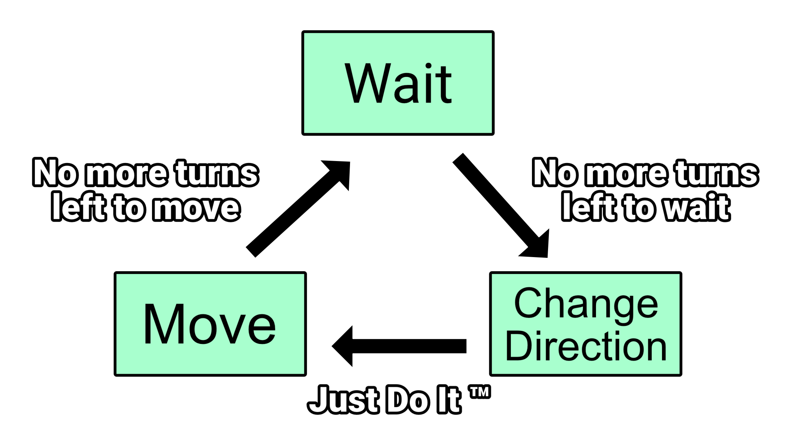

# Finite State Machine

When starting the journey with AI systems, Finite State Machines (FSM in short
from now on) are always the first choice for AI system for a reason - they are
the simplest to implement and the most intuitive decision making engines ever
invented.

Here, take a look at the states and transitions of our simple enemy behavior:

Each block is a state that enemy can be in and every arrow is a transition with
condition that has to be met to allow for transition to happen.
Here in our case there are simple, single transitions pointing from one state to
another, but in more complex behaviors there can be _infinite_ number of
transitions.

Decision making for FSM has a really simple rule applied to it:

> When decision about state change has to be made, FSM goes through all transitions
> that starts from active state and validates their conditions, first one that
> succeeds triggers change from active state to one that transition points to.
