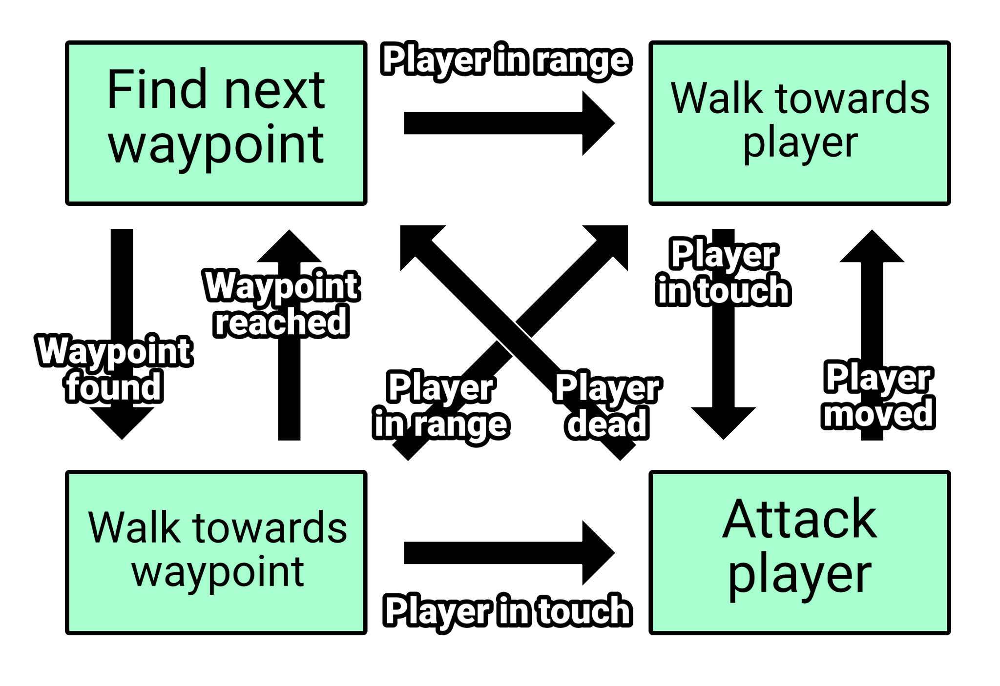
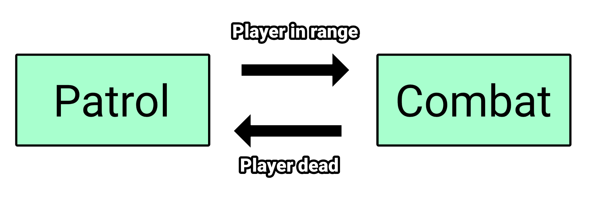
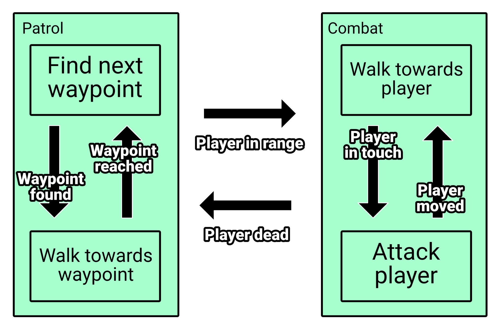

# Hierarchical Finite State Machine

In the chapter about [FSM] we have been talking about FSM being messy when number
of states grows. The reason for that was that along with number of states, number
of transitions grow exponentially, which at the point of having for example 20
different states, behavior is starting to get messy and unmanagable - for that
exact problem Hierarchical Finite State Machines (__HFSM__ for short from now on)
has got invented.

Let's take a look at some more complex FSM than what we have made in [FSM] chapter:

Number of transitions got higher and we can see that many transitions targets
same state using same condition.

When we analyze this network we can find that there are two distinct super-states:
__Patrol__ and __Combat__:

And each of these states contains their own network of sub-states:

And this is hierarchical approach to FSM:

> HFSM has the same rules for transitions as FSM, what's new is that you can use
> other FSM networks as states. Whenever FSM network, used as state in another
> FSM, gets activated, it will reset its active state to initial one.

[FSM]: ../finite_state_machine/introduction.md
