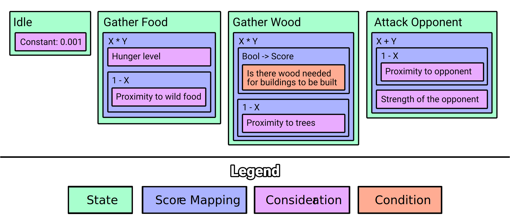

# How it works

Let's take a look again at the infographics from introduction:

There are three units that are used in scoring process: Score Mapping, Consideration
and sometimes Condition. All of them are called Scorers, because no matter what
input they get, they always return a score.

> It's important to note that although Utility AI doesn't care about the range of
> scores at the state level, it is good to keep scores in 0-1 range (percentage)
> to make math easier when performing operations on multiple scores (operations
> such as sum, or product).

Condition
---

We already have used conditions in FSM/HFSM - its role here in Utility AI is to
be mapped to score, true is 100%, false is 0% of probability. When we would use
multiple AI systems in our game, we might want to share some code units so being
able to just map condition into consideration helps a lot.

Consideration
---

Its job is actually pretty much simple: it takes agent context as input and
calculates a probability score out of it.

For example we have "Constant" consideration, which don't care about context and
always returns constant score. There is "Hunger level" consideration, which might
just return a percentage of agent hunger. Thereare also "Proximity" considerations
that might return real distances (for example in meters in world space) mapped
to percentage of given min-max range of acceptable area that objects can be
detected in - the reason for that is that Utility AI doesn't care about the actual
distances, it would rather want a percentage of how close something is so by
clamping real value to some acceptable upper and lower bounds of distance and
turning that into percentage we can easily use it as probability.

Score Mapping
---

Score mappings are there to map one or more scores to single score.

For example there is "1 - X" score mapping that takes the score of what it wraps
and performs "1 - X" operation on it. Another ones are "X * Y" (product) and
"X + Y" (sum) functions that wraps list of score mappers and calculates
product/sum on them (product and sum score mappings are really useful for
combining groups of scores for two different results - we use product operation
to achieve similar results as when using AND operation on conditions, and we use
sum operation when we aim for OR-like operation).

Summary
---

Now to sum things up, let's take a look how we could translate Scorers to functions,
to show that these concepts are in the end just data processing functions that
in the end produce final score of the state:

- Idle: `0.001`
- Gather Food: `hunger * (1 - food proximity)`
- Gather Wood: `(needs wood ? 1 : 0) * (1 - trees proximity)`
- Attack Opponent: `(1 - opponent proximity) + opponent strength`

Now imagine you have a state where

- hunger: 0.5
- distance to food: 0.9 (we assume range of 0-1 meter)
- distance to trees: 0.5 (we assume range of 0-1 meter)
- wood needed: false
- distance to oponent: 1.0 (we assume range of 0-1 meter)
- opponent strength: 0.2

So we calculate scores for these states:

- Idle: `0.001`
- Gather Food: `0.5 * (1 - 0.9)` -> `0.5 * 0.1` -> `0.05`
- Gather Wood: `0 * (1 - 0.5)` -> `0 * 0.5` -> `0`
- Attack Opponent: `(1 - 1.0) + 0.2` -> `0 + 0.2` -> `0.2`

And the winner is: __Attack Opponent__ state!

> You should note that while Utility AI is both easy to setup and develop, it's
> hard to debug and make it predictable. Also when defining behaviors that will
> use more complex scoring functions, math knowledge might be really helpful to
> properly model these behaviors.

Whenever you find yourself in the need for making fixed transitions for all of
the states, replace Utility AI with other AI systems like FSM/HFSM or Behavior
Trees.

When you would need to have only a part of the states with fixed transitions,
put them in separate AI system and use hierarchy where your Utility AI will
contain for example FSM with fixed transitions (you can do this thanks to
focusing our solutions on full modularity).
